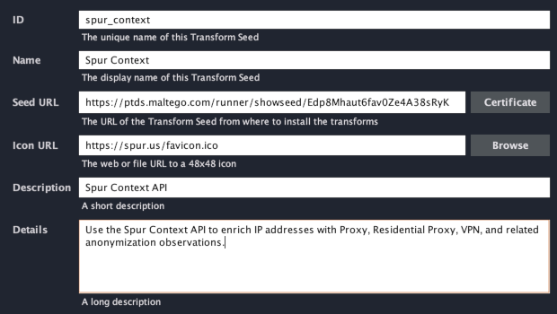
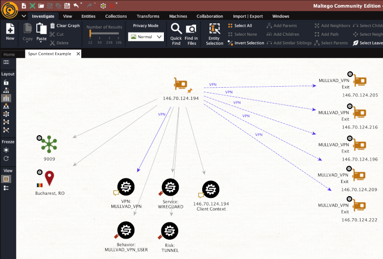

# Maltego Transform for Spur Context API

This is a Maltego Transform to enrich IP addresses with Spur Context.

The Spur Context API accepts an IPv4 or IPv6 address and returns information about VPN, Proxy, Residential Proxy, and related anonymization observations.  

- [API Information](https://spur.us/context-api)  
- [Developer Documentation](https://docs.spur.us/context-api)  
- [Spur Account (API Tokens)](https://app.spur.us/account)
- [Free Trial Dashboard](https://app.spur.us/context)  
- [Source Code](https://github.com/spurintel/spur-enrichment-for-maltego)  

## Installation

We hope to get this into the [Maltego Transform Hub](https://www.maltego.com/transform-hub/), where it will be a single-click install.  
In the meantime it can be easily installed by [adding a seed URL](https://docs.maltego.com/support/solutions/articles/15000053033-adding-an-itds-seed-to-the-desktop-client) in your client for the [Public TDS](https://ptds.maltego.com/).  

The seed URL for this transform is: `https://ptds.maltego.com/runner/showseed/Edp8Mhaut6fav0Ze4A38sRyK`

## Usage

As with any Maltego transform, right-click on an IP address entity and select the transform.  If any anonymity information is available for that IP, they will be added as entities in the graph.  The full list of possible result types is listed in the [developer documentation](https://docs.spur.us/context-api).  

 

## License

This transform code is GPLv3, but usage requires an API key from Spur Intelligence.  

The first time the transform is used, you will get a popup prompting for the API key, which can be found in your [account](https://app.spur.us/account).  The Context API will handle either IPv4 or IPv6 addresses, but Maltego treats them as separate entity types so the API key must be entered the first time the transform is used for both IPv4 and IPv6 entities.
